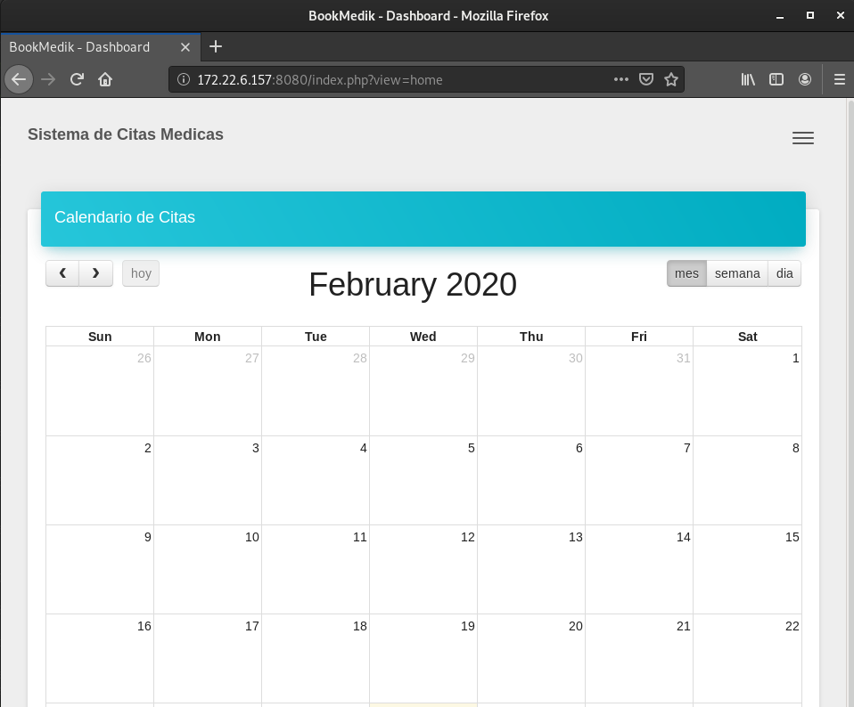
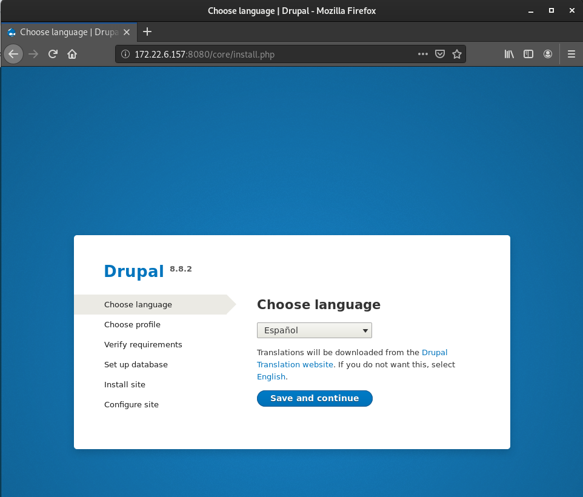
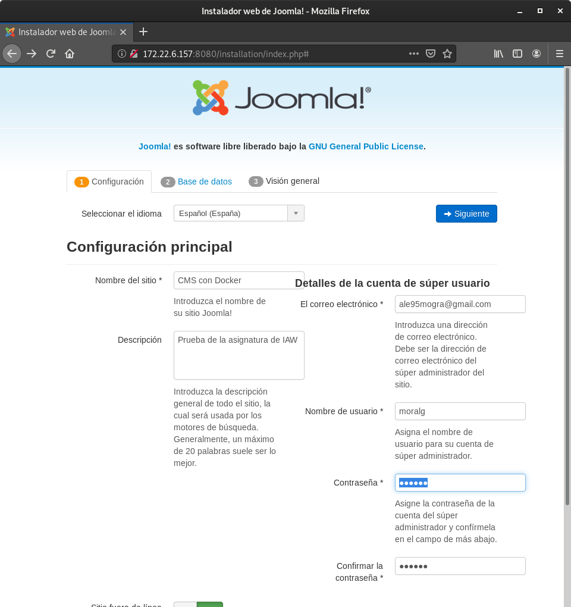
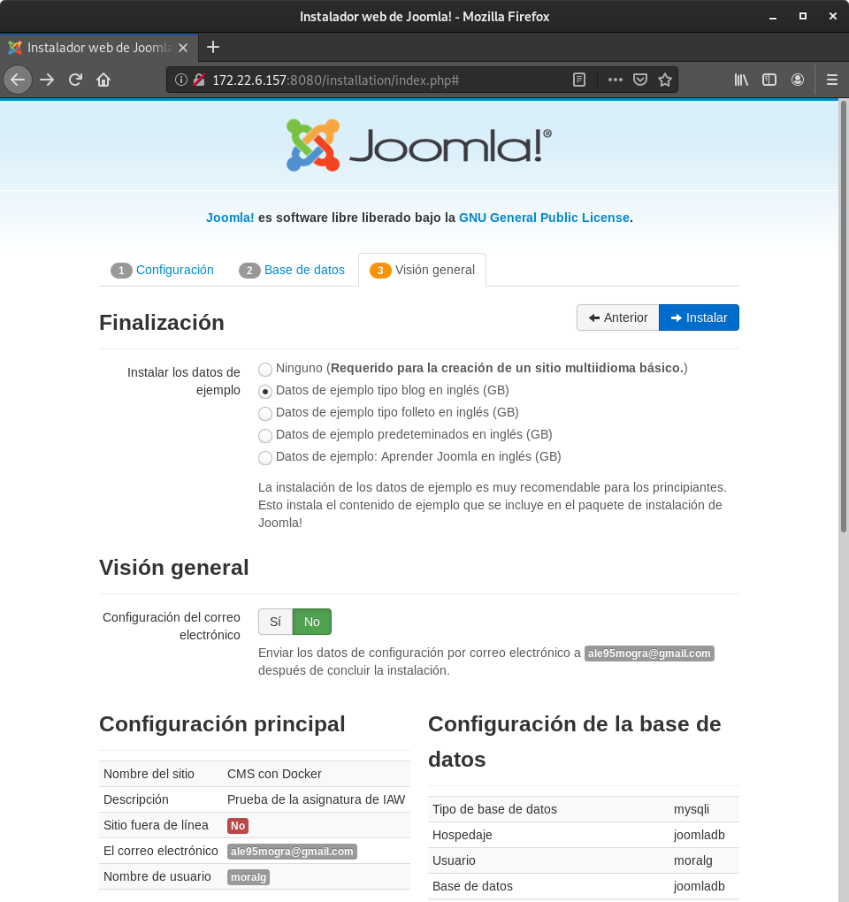
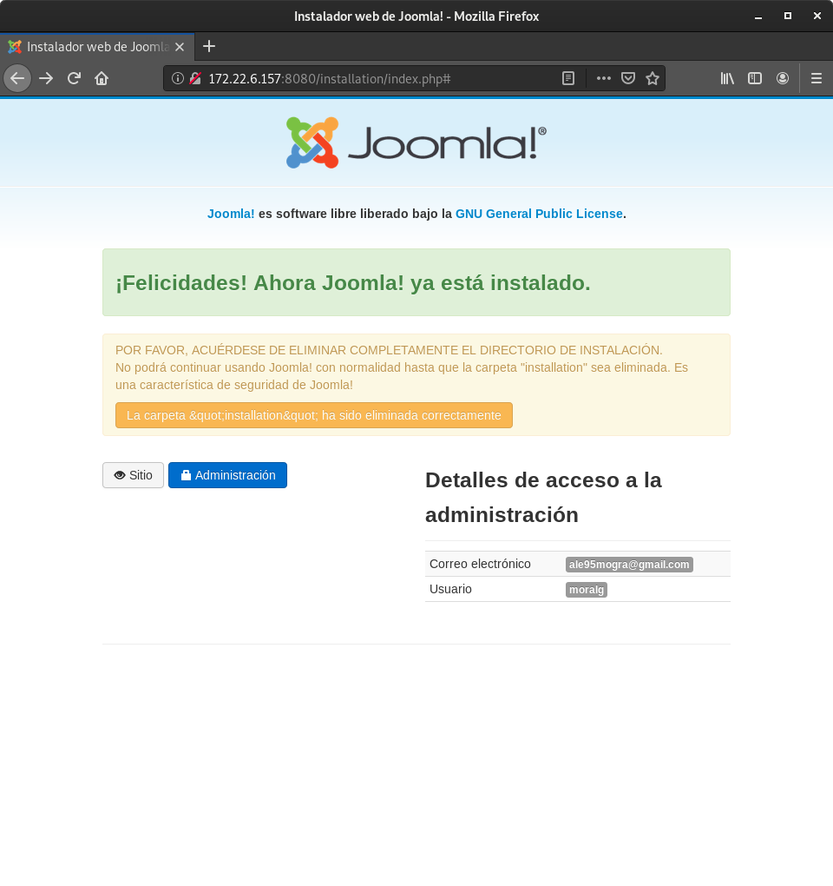
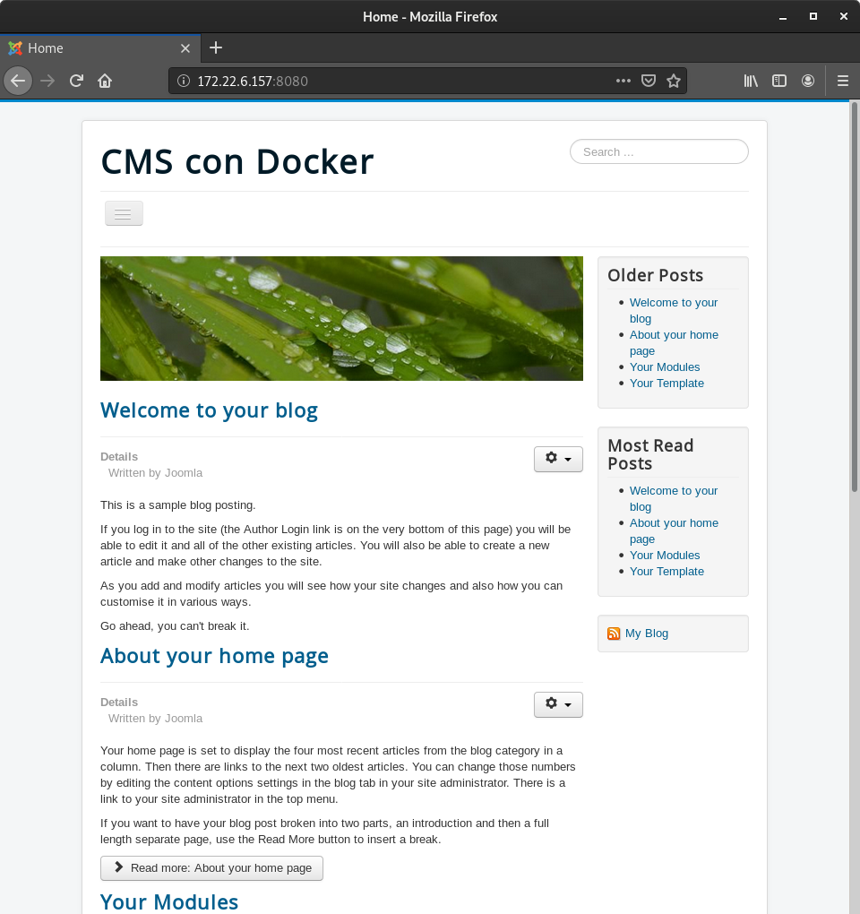

# Implantación de aplicaciones web PHP en docker

## Tarea 1 

**Ejecución de la aplicación web PHP bookMedik en docker**

* Queremos ejecutar en un contenedor docker la aplicación web escrita en PHP: bookMedik (https://github.com/evilnapsis/bookmedik).
* Es necesario tener un contenedor con mariadb donde vamos a crear la base de datos y los datos de la aplicación. El script para generar la base de datos y los registros lo encuentras en el repositorio y se llama schema.sql. Debes crear un usuario con su contraseña en la base de datos. La base de datos se llama bookmedik y se crea al ejecutar el script.
* Ejecuta el contenedor mariadb y carga los datos del script schema.sql. Para más [información](https://gist.github.com/spalladino/6d981f7b33f6e0afe6bb).
* El contenedor mariadb debe tener un volumen para guardar la base de datos.
* Crea una imagen docker con la aplicación desde una imagen base de debian o ubuntu. Ten en cuenta que el fichero de configuración de la base de datos (core\controller\Database.php) lo tienes que configurar utilizando las variables de entorno del contenedor mariadb. (Nota: Para obtener las variables de entorno en PHP usar la función getenv. Para más infomación).
* La imagen la tienes que crear en tu máquina con el comando docker build.
* Crea un contenedor a partir de la imagen anterior, enlazado con el contenedor mariadb, y comprueba que está funcionando (Usuario: admin, contraseña: admin)
* El contenedor que creas debe tener un volumen para guardar los logs de apache2.

Clonamos el repositorio.
~~~
cd /home/vagrant
git clone https://github.com/evilnapsis/bookmedik.git
~~~

Modificamos el fichero `/core/controller/Database.php` y en la función `function Database()` indicamos las variables que vamos a utilizar en el Dockerfile.

~~~
	      function Database(){
		            $this->user=getenv('User_db');$this->pass=getenv('Pass_db');$this->host=getenv('Host_db');$this->ddbb=getenv('Name_db');
    	}
~~~

Creamos un red para la conexión entre contenedores.
~~~
docker network create MiRed1
  cb5ae5e57a99d7897e151f71b0562231c8c43e71fdf0dcf14e9a6eefd7fc1ad7
~~~

Vamos a utilizar la imagen de DockerHub de MariaDB:

~~~
sudo docker run -d --name bookmedik -v /opt/mysql:/var/lib/mysql -e MYSQL_ROOT_PASSWORD=root -e MYSQL_DATABASE=bookmedik -e MYSQL_USER=moralg -e MYSQL_PASSWORD=moralg --network MiRed1 mariadb
  37aa659cf41953a2d9130c802e559449b273a00852756d900dbc425814462dff
~~~

Podemos ver que esta activo:
~~~
sudo docker ps
  CONTAINER ID        IMAGE               COMMAND                  CREATED             STATUS              PORTS               NAMES
  37aa659cf419        mariadb             "sudo docker-entrypoint.s…"   16 seconds ago      Up 14 seconds       3306/tcp            bookmedik
~~~

Ahora insertamos los datos del fichero `schema.sql` la base de datos:

~~~
cd bookmedik
sudo docker exec -i bookmedik /usr/bin/mysql -u moralg --password=moralg bookmedik < schema.sql
~~~

Vemos que se ha creado la base de datos.
~~~
ls /opt/mysql/bookmedik/
  category.frm  medic.frm    pacient.ibd	reservation.frm  status.ibd
  category.ibd  medic.ibd    payment.frm	reservation.ibd  user.frm
  db.opt	      pacient.frm  payment.ibd	status.frm	 user.ibd
~~~

Vamos a copiar la carpeta que hemos clonado en nuestro equipo, en el VirtualRoot de nuestro servidor web que vamos a instalar.

Creamos el Dockerfile.
~~~
FROM debian
RUN apt update \
    && apt install -y apache2 libapache2-mod-php php php-mysql \
    && rm /var/www/html/index.html
ENV User_db=moralg
ENV Pass_db=moralg
ENV Name_db=bookmedik
ENV Host_db=bookmedik
COPY ./bookmedik /var/www/html
CMD ["/usr/sbin/apache2ctl", "-D", "FOREGROUND"]
~~~

> **FROM**: Utilizamos la imagen de Debian Lattle
>
> **RUN**: Actualizamos, instalamos el servidor web apache, las librerias necesarias y php. Además borramos el index.html por defecto del DocumentRoot.
>
> **ENV**: Le indicamos las variables de entorno.
>
> **COPY**: Copiamos la carpeta bookmedik en el DocumentRoot.
>
> **CMD**: Para realizar el reinicio de apache al terminar de iniciar el contenedor.

Accedemos a DockerHub para subir la imagen. 
~~~
sudo docker login
  Authenticating with existing credentials...
  WARNING! Your password will be stored unencrypted in /root/.docker/config.json.
  Configure a credential helper to remove this warning. See
  https://docs.docker.com/engine/reference/commandline/login/#credentials-store

  Login Succeeded
~~~

Creamos la imagen con la configuración del Dockerfile
~~~
sudo docker build -t moralg/bookmedik:v1 .
  Sending build context to Docker daemon  5.788MB
  Step 1/7 : FROM debian
   ---> a8797652cfd9
  Step 2/7 : RUN apt update     && apt install -y apache2 libapache2-mod-php php php-mysql     && rm /var/  www/html/index.html
   ---> Using cache
   ---> 4eeb3f8a9083
  Step 3/7 : ENV User_db=moralg
   ---> Using cache
   ---> 937f92eab4a5
  Step 4/7 : ENV Pass_db=moralg
   ---> Using cache
   ---> 56efe5816984
  Step 5/7 : ENV Name_db=bookmedik
   ---> Using cache
   ---> a95adae68363
  Step 6/7 : ENV Host_db=bookmedik
   ---> Using cache
   ---> cc3df2e78338
  Step 7/7 : COPY ["./bookmedik/","/var/www/html/"]
   ---> 9f5e9b60396d
  Successfully built 9f5e9b60396d
  Successfully tagged moralg/bookmedik:v1
~~~

Subimos la imagen a DockerHub
~~~
sudo docker push moralg/bookmedik:v1
  The push refers to repository [docker.io/moralg/bookmedik]
  5a43df2fde87: Pushed 
  a7e66585e3dd: Pushed 
  ce8168f12337: Mounted from library/debian 
  v1: digest: sha256:944e3cd3c943d3857782387ac4e2a6fc30e6fa4d1d0da303d69035ab97f20d45 size: 952
~~~

Iniciamos el contenedor de apache con la imagen creada, demas de indicarle la dirección del guardado de los log.
~~~
sudo docker run -d --name apache -v /opt/apache2/:/var/log/apache2/ -p 8080:80 --network MiRed1 moralg/bookmedik:v1
  620808d7f66816083f088f87274b935c5969d26f0259544d875757b4c65835fd
~~~

Probamos que funciona la aplicación, accedemos a la dirección de nuestra máquina por el puerto 8080.

## Tarea 2 

**Ejecución de una aplicación web PHP con imagenes de PHP y apache2 de DockerHub**

* Realiza la imagen docker de la aplicación a partir de la imagen oficial PHP que encuentras en docker hub. Lee la documentación de la imagen para configurar una imagen con apache2 y php, además seguramente tengas que instalar alguna extensión de php.
* Crea esta imagen en docker hub.
* Crea un script con docker compose que levante el escenario con los dos contenedores.

Vamos a utilizar el mismo contenedor de mariadb que en el ejercicio anterior con la aplicación bookmedik.

Ahora vamos a crear un nuevo contenedor con la imagen php del Docker Hub `php:7.4-`

Creamos el Dockerfile.
~~~
FROM php:7.4-apache
RUN docker-php-ext-install pdo pdo_mysql mysqli
ENV User_db=moralg
ENV Pass_db=moralg
ENV Name_db=bookmedik
ENV Host_db=bookmedik
ENV APACHE_DOCUMENT_ROOT /var/www/html
COPY /home/vagrant/bookmedik /var/www/html
CMD ["apache2ctl", "-D", "FOREGROUND"]
~~~

Creamos la imagen.
~~~
sudo docker build -t moralg/apache-bookmedik:v1 .
~~~

Iniciamos el contenedor.
~~~
sudo docker run -d --name apache -p 8080:80 --network MiRed1 moralg/apache-bookmedik:v1
~~~

Podemos ver que la aplicación funciona correctamente. Ahora tenemos que realizar todo esto con la herramienta Docker Compose.

Creamos el fichero:
~~~
version: '3.1'

services:
  apache:
    image: moralg/apache-bookmedik:v3
    restart: always
    links:
      - bookmedik:mysql
    ports:
      - 8080:80 
  bookmedik:
    image: mariadb
    restart: always
    environment:
      MYSQL_ROOT_PASSWORD: root
      MYSQL_DATABASE: bookmedik
      MYSQL_USER: moralg
      MYSQL_PASSWORD: moralg
    volumes:
      - /opt/mysql:/var/lib/mysql
~~~

## Tarea 3

**Ejecución de un CMS en docker**

* A partir de una imagen base (que no sea una imagen con el CMS), genera una imagen que despliegue un CMS PHP (que no sea wordpress). El contenedor que se crea a partir de esta imagen se tendrá que enlazar con un contenedor mariadb o postgreSQL.
* Crea los volúmenes necesarios para que la información que se guarda sea persistente.

Descargamos drupal y lo descomprimimos.
~~~
wget https://www.drupal.org/download-latest/zip
ls
  drupal-8.8.2
~~~

Creamos un red para la conexión entre contenedores.
~~~
docker network create MiRed1
  cb5ae5e57a99d7897e151f71b0562231c8c43e71fdf0dcf14e9a6eefd7fc1ad7
~~~

Creamos el contenedor de mariadb.
~~~
sudo docker run -d --name mysql -v /opt/mysql:/var/lib/mysql -e MYSQL_ROOT_PASSWORD=root -e MYSQL_DATABASE=drupaldb -e MYSQL_USER=moralg -e MYSQL_PASSWORD=moralg --network MiRed1 mariadb
~~~

Comprobamos que esta funcionando correctamente.
~~~
sudo docker ps
CONTAINER ID        IMAGE               COMMAND                  CREATED             STATUS              PORTS               NAMES
53ea947755c2        mariadb             "docker-entrypoint.s…"   4 seconds ago       Up 3 seconds        3306/tcp            mysql
~~~

Vamos a modificar el fichero `drupal-8.8.2/sites/default/default.settings.php`, para asignarle a las variables de la base de datos.
~~~
 $databases['default']['default'] = [
   'database' => getenv('Name_db'),
   'username' => getenv('User_db'),
   'password' => getenv('Pass_db'),
   'host' => getenv('Host_db'),
   'port' => '3306',
   'driver' => 'mysql',
   'prefix' => '',
   'collation' => 'utf8mb4_general_ci',
~~~

Creamos el directorio `drupal-8.8.2/sites/default/files/translations`.
~~~
mkdir -p drupal-8.8.2/sites/default/files/translations
~~~

Renombramos el fichero `drupal-8.8.2/sites/default/default.settings.php`.
~~~
mv drupal-8.8.2/sites/default/default.settings.php drupal-8.8.2/sites/default/settings.php
~~~

Creamos el Dockerfile para la aplicación Dupal.
~~~
FROM debian
RUN apt update \
    && apt install -y apache2 libapache2-mod-php php php-mysql php-gd php-xml php-zip \
    && rm /var/www/html/index.html
ENV User_db=moralg
ENV Pass_db=moralg
ENV Name_db=drupaldb
ENV Host_db=mysql
COPY ./drupal-8.8.2 /var/www/html
RUN chown www-data:www-data -R /var/www/html \
    && chmod -R 775  /var/www/html/sites/default/files
CMD ["/usr/sbin/apache2ctl", "-D", "FOREGROUND"]
~~~

Creamos la imagen.
~~~
sudo docker build -t moralg/drupal:v1 .
~~~

~~~
sudo docker run -d --name drupal -p 8080:80 --network MiRed1 moralg/drupal:v1
~~~

## Tarea 4

**Ejecución de un CMS en docker con una imagen de DockerHub**

* Busca una imagen oficial de un CMS PHP en docker hub (distinto al que has instalado en la tarea anterior, ni wordpress), y crea los contenedores necesarios para servir el CMS, siguiendo la documentación de docker hub.

**Docker-Compose**

Creamos el fichero yml de docker-compose, lo vamos a llamar `Joomla.yml`.
~~~
version: '3.1'

services:
  joomla:
    image: joomla
    restart: always
    links:
      - joomladb:mysql
    ports:
      - 8080:80
    environment:
      JOOMLA_DB_HOST: joomladb
      JOOMLA_DB_PASSWORD: moralg
      JOOMLA_DB_USER: moralg
      JOOMLA_DB_NAME: joomladb

  joomladb:
    image: mysql:5.6
    restart: always
    environment:
      MYSQL_ROOT_PASSWORD: moralg
      MYSQL_DATABASE: joomladb
      MYSQL_USER: moralg
      MYSQL_PASSWORD: moralg
~~~

Iniciamos el escenario con el comando `docker-compose`.
~~~
docker-compose -f Joomla.yml up -d
~~~

Empezará a iniciar los contenedores y a enlazarlos, hasta que llegue a un punto que no avance y tendremos que acceder a la dirección `https://<ip-vagrant>:8080`.
~~~
.
.
.
p-name-resolve mode.
joomladb_1  | 2020-02-24 09:20:30 1 [Note] Event Scheduler: Loaded 0 events
joomladb_1  | 2020-02-24 09:20:30 1 [Note] mysqld: ready for connections.
joomladb_1  | Version: '5.6.47'  socket: '/var/run/mysqld/mysqld.sock'  port: 3306  MySQL Community Server (GPL)
joomla_1    | 
joomla_1    | MySQL Database Created
joomla_1    | ========================================================================
joomla_1    | 
joomla_1    | This server is now configured to run Joomla!
joomla_1    | 
joomla_1    | NOTE: You will need your database server address, database name,
joomla_1    | and database user credentials to install Joomla.
joomla_1    | 
joomla_1    | ========================================================================
joomla_1    | AH00558: apache2: Could not reliably determine the server's fully qualified domain name, using 172.18.0.3. Set the 'ServerName' directive globally to suppress this message
joomla_1    | AH00558: apache2: Could not reliably determine the server's fully qualified domain name, using 172.18.0.3. Set the 'ServerName' directive globally to suppress this message
joomla_1    | [Mon Feb 24 09:20:31.325902 2020] [mpm_prefork:notice] [pid 1] AH00163: Apache/2.4.38 (Debian) PHP/7.3.15 configured -- resuming normal operations
joomla_1    | [Mon Feb 24 09:20:31.325964 2020] [core:notice] [pid 1] AH00094: Command line: 'apache2 -D FOREGROUND'
~~~

Accedemos a la página para introducir los datos básicos del blog.

